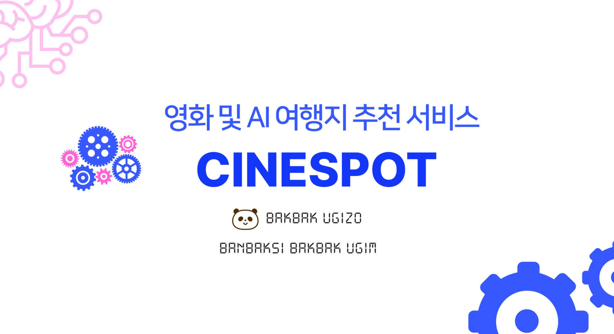
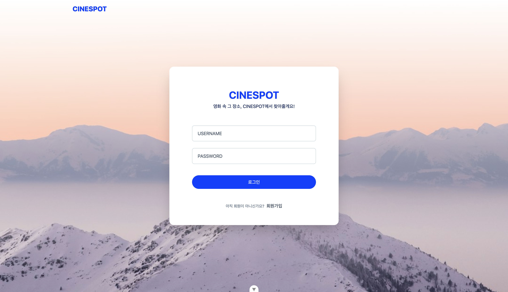
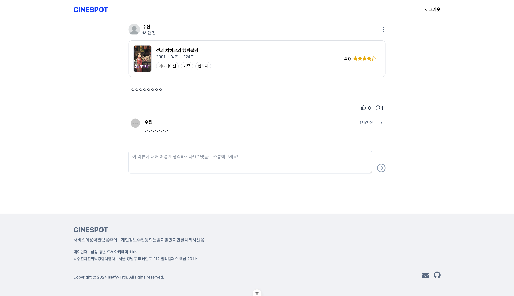
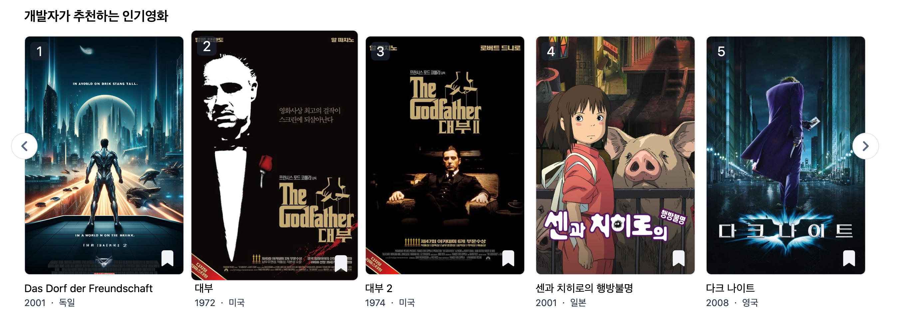
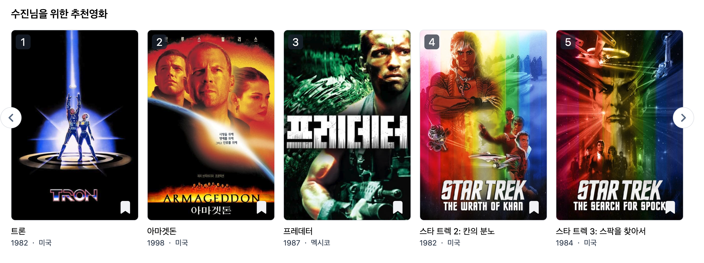
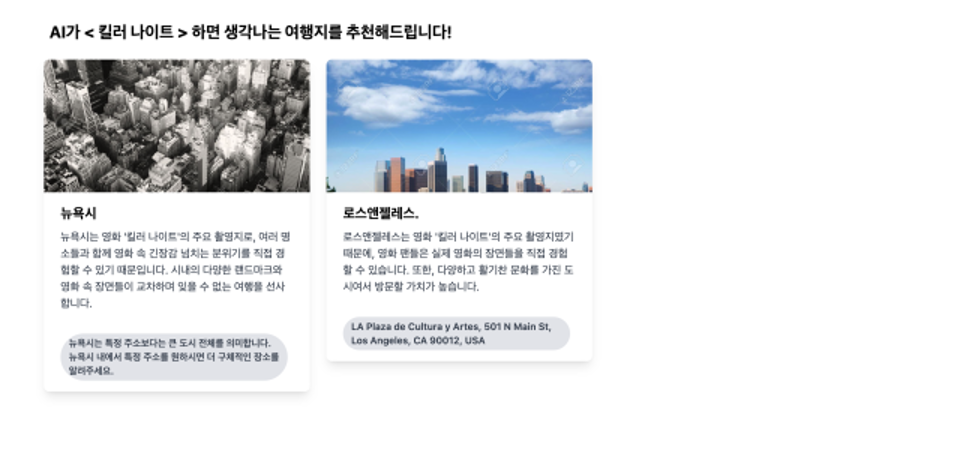
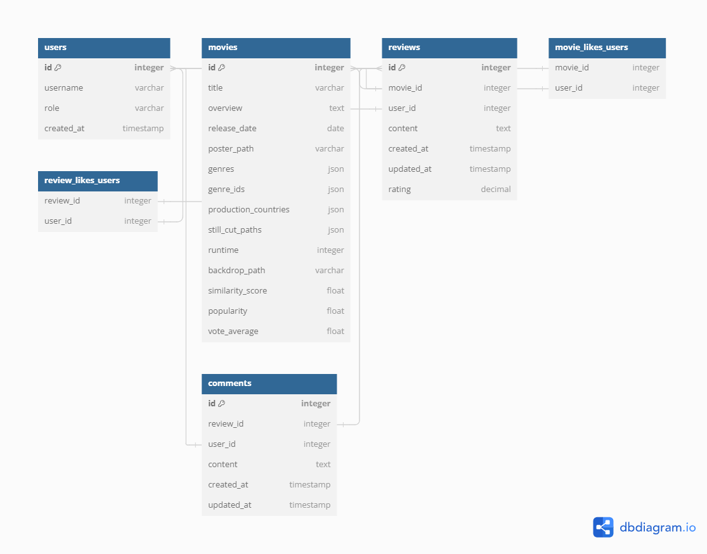

# FINAL PJT README



## 팀원 정보 및 업무 분담 내역

### 박수진(팀원)

#### - 역할: 프로젝트 매니저 / 프론트엔드 개발자 / 디자이너

#### - 담당 업무:

- 비동기 적용해 SPA로 UI 개발
  - 회원가입 / 로그인 / 로그아웃
  - 컴포넌트 재사용 (영화 캐러셀, 영화 카드, 리뷰 카드)
- vue-query를 이용한 서버사이드 상태관리
- OPEN AI 기반 영화관련 여행지 추천 기능 구현

### 박경령(팀장)

#### 역할: 서버 구축 / 데이터베이스 설계 / 백엔드 개발자

#### - 담당 업무:

- 회원 인증 시스템(회원 관리, 로그인 etc.)
- DB 구축
- 영화/리뷰/댓글 API
  - 영화 전체/세부 리스트 조회
  - 영화/리뷰 좋아요 기능
  - 리뷰&댓글 생성/조회/수정/삭제
- 영화 추천 알고리즘 구현
  - 사용자 선호 장르 기반 추천
  - 인기도+평점 평균 기반 추천

## 목표 서비스 구현 및 실제 구현 정도

모두 구현완료!!!

- 필수 기능 구현

  - [ X ] 회원관리
  - [ X ] 영화 추천 알고리즘
  - [ X ] 커뮤니티 기능

- AI 고도화
  - [ X ] AI이용한 여행지 추천

### 프로젝트 배경

- 포스트 코로나 시대로 여행 수요 증가
- 여행은 가고싶지만 어디로 가야될지 모르겠는 사용자를 위한 여행지 추천
- 여행 계획 수립에 어려움을 느끼는 사람들이 많음
- 여행지, 레저, 축제 등 여행지 정보를 따로 찾아야 하는 번거로움이 있음
- 요즘 개인 맞춤형 서비스가 늘고 있는 추세
- 2024 여행 키워드 Jetsetting : Jetsetter

### 서비스 구현 정도

- 회원 가입 / 로그인 / 로그아웃 완료
  

- 영화 리스트, 장르, 제작국가, 러닝타임 등 영화 세부 내용 조회 기능 완료
  

- 리뷰 댓글 작성, 조회, 수정, 삭제 완료
  

- 인기도 + 평점 기반 알고리즘 구현 완료
  

```python
@api_view(['GET'])
def popul_vote_recommend(request):

    developer_preference = {
        'popularity_weight': float(request.GET.get('popularity_weight', 0.1)),
        'vote_average_weight': float(request.GET.get('vote_average_weight', 0.9))
    }

    # 데이터베이스에서 모든 영화 가져오기
    movies = Movie.objects.all()
    scored_movies = []
    print('popularity_weight','vote_average_weight')
    for movie in movies:
        score = personalized_score(movie, developer_preference['popularity_weight'], developer_preference['vote_average_weight'])
        scored_movies.append((movie.title, score, movie))

    scored_movies.sort(key=lambda x: x[1], reverse=True)
    top_scored_movies = scored_movies[:10]

    recommended_movies = [movie[2] for movie in top_scored_movies]

    # 영화 Serializer로 직렬화
    serializer = MovieSerializer(recommended_movies, many=True, context={'request': request})

    # 결과 딕셔너리 구성
    response_data = {
        "developer_preference": developer_preference,
        "movie_recommendations": serializer.data
    }

    return Response(response_data)
```

- 사용자 좋아요 기반 알고리즘 구현 완료
  

```python
# View for movie recommamdation service
@api_view(['GET'])
def genre_recommendations(request):
   # 현재 로그인한 사용자의 정보 가져오기
    user = request.user

    if user.is_authenticated:
        # 사용자가 좋아하는 영화의 장르 정보 가져오기
        user_liked_genres = [genre for movie in user.liked_movies.all() for genre in movie.genres]

        # 모든 영화의 장르 정보 가져오기
        all_movies = Movie.objects.exclude(id__in=user.liked_movies.all().values_list('id', flat=True))

        # 유사도 계산
        similarities = []
        for movie in all_movies:
            similarity = compute_cosine_similarity(user_liked_genres, movie.genres)
            similarities.append((movie.title, similarity))

        # 유사도에 따라 정렬
        sorted_similarities = sorted(similarities, key=lambda x: x[1], reverse=True)
        # 상위 10개의 유사한 영화 추출
        top_similar_movies = sorted_similarities[:10]
        # print(top_similar_movies)

        # 추천 영화 정보 가져오기
        recommended_movie_titles = [movie[0] for movie in top_similar_movies]
        recommended_movies = []
        for title in recommended_movie_titles:
            movie = Movie.objects.get(title=title)
            recommended_movies.append(movie)
        # 영화 Serializer로 직렬화
        serializer = MovieSerializer(recommended_movies, many=True)

        # 결과 딕셔너리 구성
        response_data = {
            "user_liked_genres": user_liked_genres,
            "similarity_res": {movie[0]: movie[1] for movie in top_similar_movies},
            "movie_recommendations": serializer.data
        }

        return Response(response_data)
    else:
        return Response({'error': 'User not authenticated'}, status=status.HTTP_401_UNAUTHORIZED)
```

- OPEN API 이용한 영화 기반 여행지 추천 완료
  

```python
def generate_recommendations(movie_title, release_year):
    recommended_destinations = []
    recommendations = {
        "movie_title": movie_title,
        "release_year": release_year,
        "recommended_destinations": recommended_destinations,
    }
    for i in range(2):
        first_prompt = f"영화 '{movie_title}'(출시 연도: {release_year})의 여행지 추천. 목적지 이름 정확히 하나만 알려줘"
        if i > 0:
            first_prompt = f"영화 '{movie_title}'(출시 연도: {release_year})의 여행지로 {destination}을 추천 받았어. 다른 목적지 정확히 하나만 추천해줘"
        response = client.chat.completions.create(
            model="gpt-4o",
            messages=[
                {"role": "system", "content": "You are a travel recommendation assistant. you should say exact words only."},
                {"role": "user", "content": first_prompt}
            ]
        )
        destination = response.to_dict()['choices'][0]['message']['content']

        response = client.chat.completions.create(
            model="gpt-4o",
            messages=[
                {"role": "system", "content": "You are a travel recommendation assistant. you should say exact words only."},
                {"role": "user", "content": f"영화 '{movie_title}'(출시 연도: {release_year})의 여행지로 {destination}을 추천 받았어. 이걸 추천한 적절한 이유 알려줘."}
            ]
        )
        reason = response.to_dict()['choices'][0]['message']['content']

        response = client.chat.completions.create(
            model="gpt-4o",
            messages=[
                {"role": "system", "content": "You are a travel recommendation assistant. you should say exact words only."},
                {"role": "user", "content": f"영화 '{movie_title}'(출시 연도: {release_year})의 여행지로 {destination}을 추천 받았어. 여기 정확한 주소 알려줘"}
            ]
        )
        address = response.to_dict()['choices'][0]['message']['content']
        image = get_top_image_url(destination+" 풍경")
        recommended_destinations.append({
            "destination": destination,
            "reason": reason,
            "address": address,
            "image_url": image
        })
    return recommendations
```

## 데이터베이스 모델링 (ERD)



- 일대다 관계

  - User -> Review: 한 사용자가 여러 리뷰를 작성할 수 있습니다.
  - Movie -> Review: 한 영화가 여러 리뷰를 가질 수 있습니다.
  - Review -> Comment: 한 리뷰가 여러 댓글을 가질 수 있습니다.
  - User -> Comment: 한 사용자가 여러 댓글을 작성할 수 있습니다.

- 다대다 관계
  - User <-> Movie: 한 사용자가 여러 영화를 좋아할 수 있고, 한 영화도 여러 사용자에게 좋아요를 받을 수 있습니다.
  - User <-> Review: 한 사용자가 여러 리뷰를 좋아할 수 있고, 한 리뷰도 여러 사용자에게 좋아요를 받을 수 있습니다.

## 영화 추천 알고리즘에 대한 기술적 설명

### 알고리즘 개요

### 알고리즘 종류: 콘텐츠 기반 필터링, 사용자 경험 기반 추천

주요 기능: 인기도/평점 기반 추천, 사용자 선호 장르 기반 추천

### 기술적 설명

#### - 사용자 경험 기반 추천: 사용자의 활동을 바탕으로 선호하는 영화 장르 필드를 바탕으로 코사인 유사도 계산을 통한 영화 추천

#### - 콘텐츠 기반 필터링: 영화의 메타데이터를 활용한 추천

### 핵심 기능에 대한 설명

프로젝트의 핵심 기능들을 간략히 설명합니다.

- 사용자 관리
- 회원가입 및 로그인
- 영화 리스트 조회 및 추천

- **영화 추천(개인 맞춤형 영화 추천)**

  - 콘텐츠 기반 필터링: 인기도/평점 평균을 이용한 가중치 기반 영화 추천
  - 사용자 경험 기반 추천: 사용자가 좋아요한 영화를 기반으로 비슷한 장르 영화 추천

- **생성형 OPEN AI** 활용한 영화 기반 여행지 추천

  - input: 영화 제목, 제작년도 입력
  - output: 여행지 이름 / 추천이유 / 이미지 / 주소 추출

## 기타 (느낀점, 후기 등)

### - 팀원 박수진짜진짜의 후기

#### 짧은기간이었지만 고민할만할 기술적 문제들이 있었고, 해결하는 과정에서 뷰에 대해 잘 알게될 수 있어 좋았습니다. 간단하지만 openAI를 적용하여 데이터를 추출하고 가공하는 경험을 할 수 있어 좋았습니당~~ 1학기 끝나서 행보켐 경령언니랑 페어라서 행복했다!!!!!!!!!!

### - 팀장 박경령차영차의 후기

#### 시간이 부족해서 처음 목표했던 수준은 구현해내지 못했지만 필수 기능은 다 구현해서 다행이라고 생각합니다 ^^.. 아 담주 월욜 발표였음 더 잘할 수 있었는데~~~~~!(?) 짧은 기간이지만 웹 개발자의 삶을 체험한 것 같고 프론트 마스터랑 짝이어서 이만한 퀄리티라도 나왓다고 생각합니다 박박우기조 짱짱 박수진짜진짜 짱짱!
